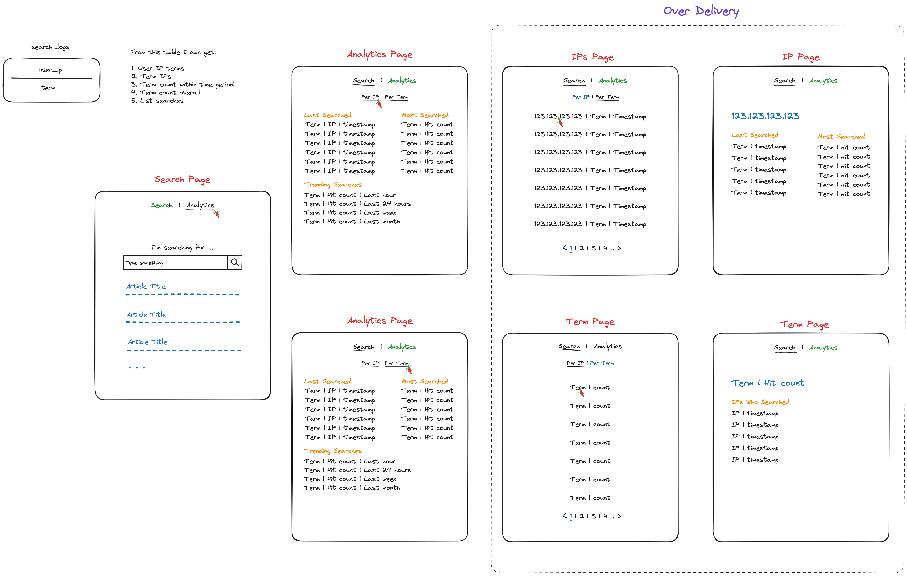

# Search Trends Dashboard 📊

- [Live Demo](https://search-trends-rails-fe7d46ba78d1.herokuapp.com)

## Installation
### Prerequisites

| Tool | Download and install |
|--|--|
| Git | [Link](https://git-scm.com/downloads) |
| Docker compose | [Link](https://docs.docker.com/compose/install/)  |

### Getting Started
- Clone the current repository
	- `git clone git@github.com:od-c0d3r/search_trends_rails.git`
- Run command to start docker containers
	- `docker-compose up --build`

## Future Improvements

With extra available time we could:
- Refactor code.
- Use Sidekiq jobs to perform database calls to avoid request flow interuption and provide scaleabilty.
- Use ActionCable to broadcast analytics to view it on realtime.
- Finish and Enhance planed UI/UX.
